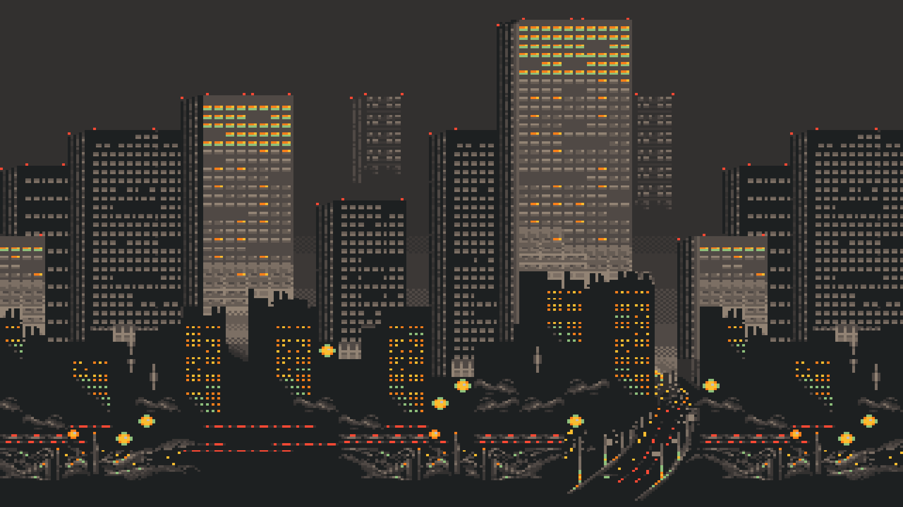

# Gentoo dwm setup



My dwm and dwmblocks setup for Gentoo Linux, based on [dwm-gruvbox by Ampersand](https://github.com/Andrey0189/dwm-gruvbox)

## Changes
- Custom keyboard layout switcher wrapper based on `xkb-switch`
- New keybinds:
  - `Super + V` for CopyQ clipboard manager
  - `Super + Shift + S` / `PrintScreen` for Flameshot screenshots
  - `Ctrl + Alt + T` to open terminal (`alacritty`)
  - `Super + Q` to close focused window
- Added custom bind for Clipboard manager (`Super + V`)
- Added custom bash script for changing brightness with multi-monitor support (depends on `xdotool` and `ddcutil`)
- Enabled status bar systray
- Reduced window borders (2px) and gaps (10px)
- And some custom rules for TDesktop and its forks

## Installation
```bash
git clone https://github.com/nixxoq/dotfiles -b gentoo_exp
cd dotfiles
chmod +x setup.sh
./setup.sh
```

If you use a display manager:
  * Select Dwm session on your login screen.

If you don't:
```bash
echo "exec /usr/local/bin/startdwm.sh" >> ~/.xinitrc
```